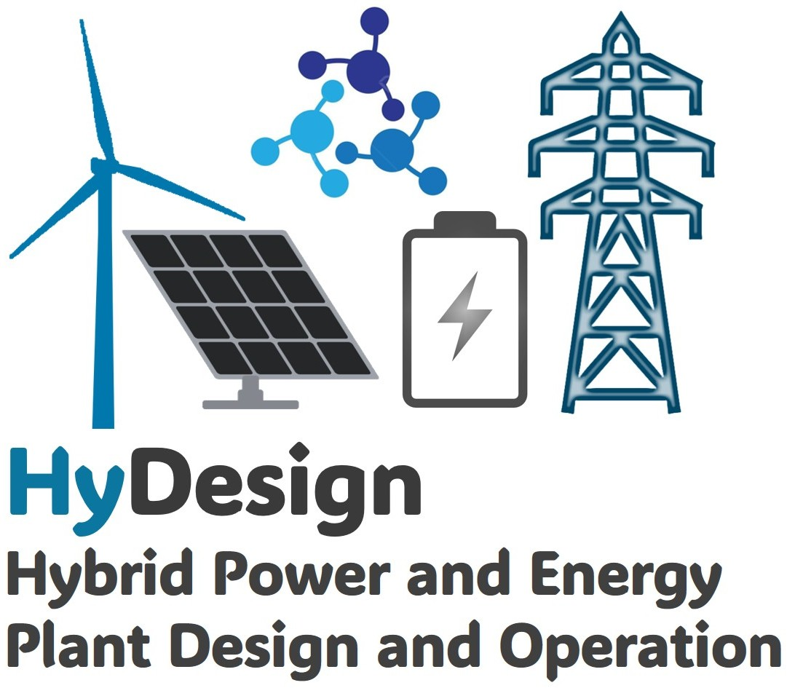

Welcome to HyDesign
===========================================

**HyDesign** is the DTU tool for design, control and optimization of utility scale Hybrid Power- and Energy Plants including  wind, solar, storage and P2X technologies.

.. note::

   New to HyDesign? For installation instructions, please see the :ref:`Installation Guide <installation>`. 
   For an in-depth explanation of how to work with HyDesign, please see :download:`Working with HyDesign <HyDesign_Instructions.pdf>`.
   Try HyDesign in the notebook :doc:`notebooks/Quickstart`.

Source code repository and issue tracker:
    `GitLab Repository <https://gitlab.windenergy.dtu.dk/TOPFARM/hydesign>`_

License:
    `MIT <https://gitlab.windenergy.dtu.dk/TOPFARM/hydesign/blob/main/LICENSE>`_

Video Tutorials
^^^^^^^^^^^^^^^^

A series of tutorial videos are available to assist you in working with HyDesign:

.. grid:: 1

    .. grid-item-card:: Working with HyDesign

        .. youtube:: bggJUsrfplY

    .. grid-item-card:: Google Colab Tutorial

        .. youtube:: tQ5vryIjzn4

    .. grid-item-card:: Introduction to HPPs

        .. youtube:: cJe21EpM46Y

Documentation
^^^^^^^^^^^^^
Explanations of hydesign's core objects can be found in the following tutorials:

.. grid:: 3

    .. grid-item-card:: Evaluation Tutorials

        Learn how to evaluate hybrid power plants.

        :doc:`Open Tutorials <tutorials/index>`

    .. grid-item-card:: Sizing Tutorials

        Optimize HPP and P2X configurations.

        :doc:`Open Tutorials <tutorials/index>`
        
    .. grid-item-card:: HiFi EMS

        High-fidelity energy management system examples.

        :doc:`Open HiFi EMS Tutorial <notebooks/HiFiEMS>`

    .. grid-item-card:: Changelog

        See the latest features, improvements, and fixes.

        :doc:`Open the Changelog <notebooks/ChangeLog>`
        
.. toctree::
   :hidden:

   installation
   how_to_cite
   tutorials/index
   publications/index
   notebooks/ChangeLog
   api_reference

    

Related DTU Software
^^^^^^^^^^^^^^^^^^^^

.. grid:: 2

    .. grid-item-card:: Balancing Tool Chain (BTC)

        Hour-ahead balancing and AFC simulation framework.

        **Documentation**

        `BTC Documentation <https://btc_group.pages.windenergy.dtu.dk/btc/>`_

        **Repository**

        `BTC GitLab Repository <https://gitlab.windenergy.dtu.dk/btc_group/btc>`_

    .. grid-item-card:: CorRES

        Renewable generation time-series simulation with spatial and temporal correlations.

        **Repository**

        `CorRES GitLab Repository <https://gitlab.windenergy.dtu.dk/corres/corres>`_

    .. grid-item-card:: Balmorel

        Energy system optimisation and electricity market analysis.

        **Documentation**

        `Balmorel Documentation <https://balmorelcommunity.github.io/Balmorel/>`_

        **Repository**

        `Balmorel GitHub Repository <https://github.com/balmorelcommunity/Balmorel>`_

    .. grid-item-card:: TopFarm2

        Wind farm layout and design optimisation framework.

        **Documentation**

        `TopFarm2 Documentation <https://topfarm.pages.windenergy.dtu.dk/TopFarm2/>`_

        **Repository**

        `TopFarm2 GitLab Repository <https://gitlab.windenergy.dtu.dk/TOPFARM/TopFarm2>`_

    .. grid-item-card:: OptiWindNet

        Offshore wind farm cable network optimisation.

        **Documentation**

        `OptiWindNet Documentation <https://optiwindnet.readthedocs.io/>`_

        **Repository**

        `OptiWindNet GitLab Repository <https://gitlab.windenergy.dtu.dk/TOPFARM/OptiWindNet>`_
